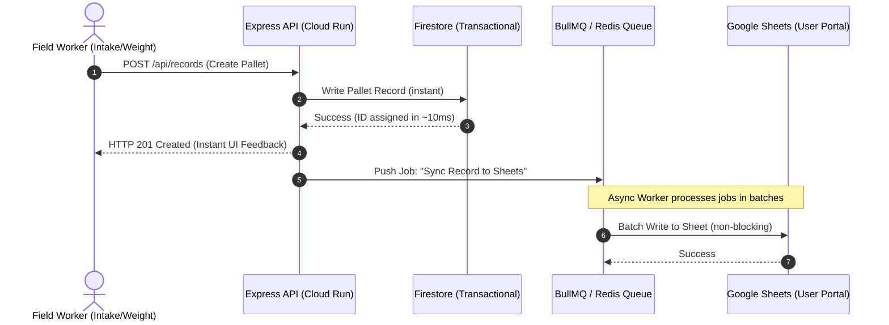

# 📊 Sheets Optimization & Scale-Proofing Strategy
**TsuberMango Systems Architecture | May 2026**

---

## 🔴 The Current Technical Risk
The current TsuberMango backend uses Google Sheets as its primary transactional database. For operations like `getAllRecords`, `updateRowById`, and `getNextId`, the server fetches the **entire spreadsheet range (`A:O`)** into backend server memory for every query.

During peak harvest, multiple packing house workers perform transactions simultaneously:
1. **High Latency**: Loading hundreds of rows over HTTP from the Google Sheets API takes between 600ms and 1500ms per request.
2. **Rate Limiting**: The Google Sheets API enforces a strict quota (usually 60 requests per minute per user/project). In peak hours, this limit is easily breached, leading to `429 Too Many Requests` errors.
3. **Data Loss & Operational Stalls**: If the API rate limit is hit, the application stalls, the intake forms fail to submit, and the logistics line at the packing house is blocked.

---

## 🟢 The Solution: "Firestore-First, Write-Through Sheets"
To eliminate blocking API limits and reduce data latency to under 15ms, we propose migrating the primary transactional layer to **Firebase Firestore**, while transforming Google Sheets into a **non-blocking, asynchronous read-replica/export target**.



---

## 🛠️ Step-by-Step Technical Implementation Plan

### 1. Firestore Data Modeling
We will model pallet records inside a sub-collection structured by season and farmer.
```
/seasons/{seasonId}
   ├── status: "active" | "archived"
   └── farmers/{farmerId}
          └── pallets/{palletId} (Document)
                 ├── id: Integer (Incrementing index)
                 ├── shipmentDate: String
                 ├── cardId: String
                 ├── harvestDate: String
                 ├── palletNumber: String
                 ├── kind: String
                 ├── size: String
                 ├── boxes: Integer
                 ├── weight: Double
                 ├── destination: String
                 ├── sent: Boolean
                 ├── gidon: Boolean
                 ├── mark: Boolean
                 ├── editedBy: String
                 ├── editedAt: String
```

### 2. Transactional API Redirection
The backend controllers (`sheetController.js`) will be refactored to read and write directly to Firestore using the `firebase-admin` SDK:
- **Intake Creation (`POST`)**: Write a document to Firestore. Use a transactional counter for the incrementing integer ID.
- **Records Fetching (`GET`)**: Query Firestore collections. Supports fast server-side pagination, indexing, and complex filtering (e.g., filtering unweighed pallets) in <20ms.
- **Row Updates (`PUT`)**: Directly update the corresponding document.

### 3. Asynchronous Sheets Sync Queue
To sync the data back to Google Sheets without blocking client requests, we will implement a background queue:
- When a write occurs in Firestore, the Express route pushes a replication job (containing the farmer name, pallet ID, and updated data) to a lightweight in-memory queue (like `async.queue` or a Redis-backed `BullMQ` instance).
- A worker process consumes these jobs, groups updates by farmer, and executes a batch write to the Google Sheets API (`sheets.spreadsheets.values.batchUpdate`).
- If Google Sheets is offline or rate-limited, the worker retries with exponential backoff. The frontend experiences **100% uptime**.

---

## ⚖️ Trade-offs and Mitigations

| Challenge | Impact | Mitigation Strategy |
| :--- | :--- | :--- |
| **Dual Database Out-of-Sync** | If the sync queue fails permanently, Firestore and Google Sheets will diverge. | - Implement a manual "Force Re-sync" button in the Admin Settings tab.<br>- Maintain a dead-letter queue (DLQ) in Firestore logging failed sync jobs for easy auditing. |
| **Real-time Collaboration** | Excel power users editing Google Sheets directly won't see changes reflected in Firestore. | - Make it clear that Google Sheets is **Read-Only / Export-Only** for the logistics staff.<br>- Or, run a nightly reconciliation script that compares Sheets with Firestore and alerts admins of discrepancies. |

---

## 📅 Suggested Implementation Effort
- **Firestore Schema Setup & Migration Script**: 1 Day
- **Backend Refactor (`sheetController.js` and `sheetModel.js`)**: 2 Days
- **Queue System & Re-Sync Admin Controls**: 2 Days
- **Testing, Validation & Production Rollout**: 1 Day
- **Total Estimated Effort**: **~5-6 working days**
